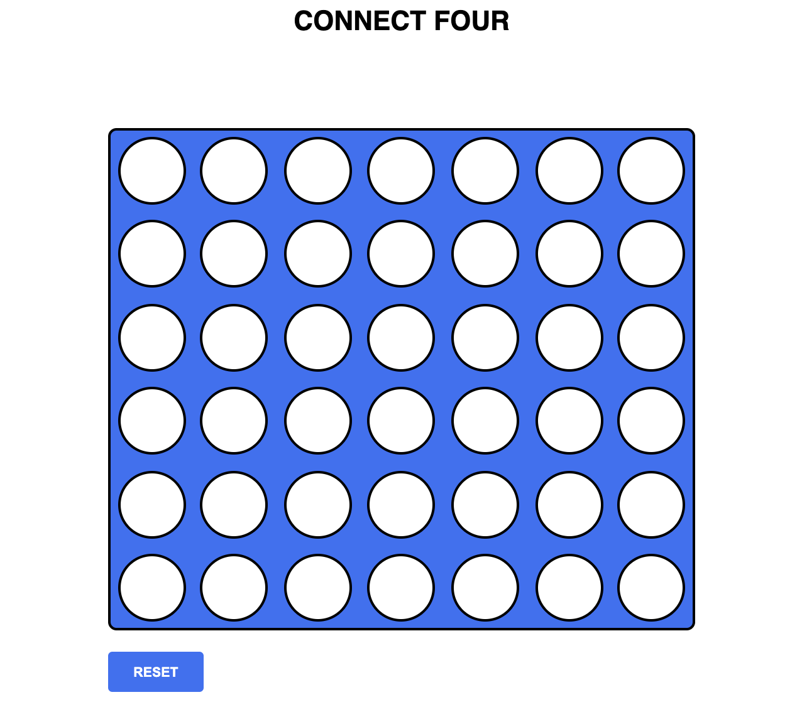

# Connect Four
https://hayley0918.github.io/Connect-Four/

### history

This game is centuries old, Captain James Cook used to play it with his fellow officers on his long voyages, and so it has also been called "Captain's Mistress". Milton Bradley published a version of this game called "Connect Four" in 1974.

Other names for this this game are "Four-in-a-Row" and "Plot Four".

### about

Connect Four is a two-player connection board game in which the players first choose a color and then take turns dropping one colored disc from the top into a seven-column, six-row vertically suspended grid. The pieces fall straight down, occupying the lowest available space within the column. The objective the game is to be the first to form a horizontal, vertical, or diagonal line of four of one's own discs. Connect Four is a solved game. The first player can always win by playing the right moves.

### built with

- Html
- Css
- JavaScript
- DOM Manipulation
- Event Handlers